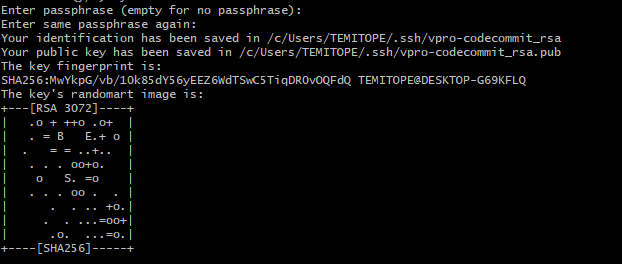
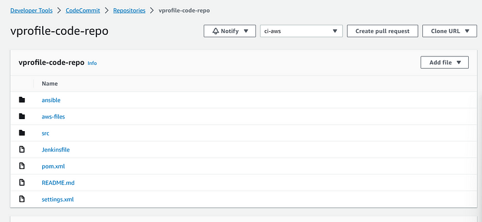

# Project-19: Continuous Delivery on AWS Cloud

[*Project Source*](https://www.udemy.com/course/devopsprojects/learn/lecture/23899708#overview)


### Pre-Requisites:

* AWS Account
* Sonar Cloud Account
* AWS CLI, Git installed 

### Step-1: Setup AWS CodeCommit

- From AWS Console, chooseus-east-1 region and go to `CodeCommit` service. Create repository.
```sh
Name: vprofile-code-repo
```
- Next, create an `IAM` user `vprofile-code-admin` with `CodeCommit` access from IAM console. Create a policy for `CodeCommit` and allow full access only for `vprofile-code-repo`.

```sh
Name: vprofile-code-admin-repo-fullaccess
```


 - To be able connect the repo, follow steps given in CodeCommit.
 

- Create SSH key in local system and upload the public key to IAM role Security credentials.
```sh
ssh-keygen.exe
cd .ssh
ls
cat vpro-codecommit_rsa.pub
```




- Update configuration under `.ssh/config` using `vim config` , add the host information and change permissions with `chmod 600 config`
```sh
Host git-codecommit.us-east-1.amazonaws.com
User <SSH_Key_ID_from IAM_user>
IdentityFile ~/.ssh/vpro-codecommit_rsa
```
- Test the ssh connection to CodeCommit.
```sh
ssh git-codecommit.us-east-1.amazonaws.com
```


- Next, clone the repository to a location of your choice in your local server.
- Convert the Github repository for `vprofile-project` in your local server, to your CodeCommit repository.
- Run the command below.
```sh
git clone ssh://git-codecommit.us-east-1.amazonaws.com/v1/repos/vprofile-code-repo
git checkout master
git branch -a | grep -v HEAD | cut -d'/' -f3 | grep -v master > /tmp/branches
for i in `cat  /tmp/branches`; do git checkout $i; done
git fetch --tags
git remote rm origin
git remote add origin ssh://git-codecommit.us-east-1.amazonaws.com/v1/repos/vprofile-code-repo
cat .git/config
git push origin --all
git push --tags
```

- Repository is ready on CodeCommit with all branches.


### Step-2: Setup AWS Code Artifact

- Create Code Artifact repository for Maven.
```sh
Name: vprofile-maven-repo
Public upstream Repo: maven-central-store
This AWS account
Domain name: visualpath
```


- Two repositories were created, maven - central will store the dependencies

- Again, follow connection instructions given in Code Artifact for `maven-central-repo.`


- Create an `IAM user` for Code Artifact and configure aws CLI with its credentials, give Programmatic access to this user to enable use of aws cli and download credentials file.
```sh
IAM username: vprofile-cart-admin

aws configure # provide iam user credentials
```


- Execute below commands to get token as in the instructions.
```sh
export CODEARTIFACT_AUTH_TOKEN=`aws codeartifact get-authorization-token --domain visualpath --domain-owner 206080409328  --region us-east-1 --query authorizationToken --output text`
echo $CODEARTIFACT_AUTH_TOKEN
```


- Update `pom.xml` and `setting.xml` file with correct URLs as suggested in instruction then push files to CodeCommit. 
```sh
cd /c/vprofile-project/
ls
git checkout ci-aws
vim settings.xml

vim pom.xml

git add .
git commit -m "updated pom and settings with codeartifact details"
git push origin ci-aws
```

### Step-3: Setup Sonar Cloud

- Create a Sonar Cloud  Account.
- From account avatar -> `My Account` -> `Security`. Generate token name as `vprofile-sonartoken`. Note the token.


- Next we create a project, `+ `-> `Analyze Project` -> `create project manually`. Below details will be used in our Build.
```sh
Organization: yemicloudguruproject
Project key: vprofile-repo9
```
- Sonar Cloud is ready!


### Step-4: Store Sonar variables in System Manager Parameter Store

- Create parameters with the variables below.
```sh
Organization: yemicloudguruproject
HOST: https://sonarcloud.io
Project: vprofile-repo9
sonartoken: 
Codeartifact token:
```


### Step-5: AWS CodeBuild for SonarQube Code Analysis

- From AWS Console, go to `CodeBuild` -> `Create Build Project`. This step is similar to Jenkins Job.
```sh
ProjectName: Vprofile-Build
Source: AWS CodeCommit
Branch: ci-aws
Environment: Ubuntu
runtime: standard
New service role
Insert build commands from folder aws-files/sonar_buildspec.yml
Logs-> GroupName: vprofile-nvirbuildlogs
StreamName: sonarbuildjob
```

- Update sonar_buildspec.yml file parameter store sections with the exact names we have given in SSM Parameter store.

sonar_buildspec.yml file
```sh
version: 0.2
env:
  parameter-store:
    LOGIN: sonartoken
    HOST: HOST
    Organization: Organization
    Project: project
    CODEARTIFACT_AUTH_TOKEN: codeartifact-token
phases:
  install:
    runtime-versions:
      java: corretto17
    commands:
    - cp ./settings.xml /root/.m2/settings.xml
  pre_build:
    commands:
      - apt-get update
      - apt-get install -y jq checkstyle
      - wget http://www-eu.apache.org/dist/maven/maven-3/3.8.8/binaries/apache-maven-3.8.8-bin.tar.gz
      - tar xzf apache-maven-3.8.8-bin.tar.gz
      - ln -s apache-maven-3.8.8 maven
      - wget https://binaries.sonarsource.com/Distribution/sonar-scanner-cli/sonar-scanner-cli-3.3.0.1492-linux.zip
      - unzip ./sonar-scanner-cli-3.3.0.1492-linux.zip
      - export PATH=$PATH:/sonar-scanner-3.3.0.1492-linux/bin/
  build:
    commands:
      - mvn test
      - mvn checkstyle:checkstyle
      - echo "Installing JDK11 as its a dependency for sonarqube code analysis"
      - apt-get install -y openjdk-11-jdk
      - export JAVA_HOME=/usr/lib/jvm/java-11-openjdk-amd64
      - mvn sonar:sonar -Dsonar.login=$LOGIN -Dsonar.host.url=$HOST -Dsonar.projectKey=$Project -Dsonar.organization=$Organization -Dsonar.java.binaries=target/test-classes/com/visualpathit/account/controllerTest/ -Dsonar.junit.reportsPath=target/surefire-reports/ -Dsonar.jacoco.reportsPath=target/jacoco.exec -Dsonar.java.checkstyle.reportPaths=target/checkstyle-result.xml
      - sleep 5
      - curl https://sonarcloud.io/api/qualitygates/project_status?projectKey=$Project >result.json
      - cat result.json
      - if  [$(jq -r '.projectStatus.status' result.json) = ERROR ] ; then $CODEBUILD_BUILD_SUCCEEDING -eq 0 ;fi
```
- Build the project.


### Step-6: AWS CodeBuild for Build Artifact

- From AWS Console, go to `CodeBuild` -> `Create Build Project`. 
```sh
ProjectName: Vprofile-Build-Artifact
Source: CodeCommit
Branch: ci-aws
Environment: Ubuntu
runtime: standard:5.0
Use existing role from previous build
Insert build commands from foler aws-files/build_buildspec.yml
Logs-> GroupName: vprofile-nvirbuildlogs
StreamName: buildjob
```

build_buildspec.yml file
```sh
version: 0.2
env:
  parameter-store:
    CODEARTIFACT_AUTH_TOKEN: codeartifact_token
phases:
  install:
    runtime-versions:
      java: corretto17
    commands:
      - cp ./settings.xml /root/.m2/settings.xml
  pre_build:
    commands:
      - apt-get update
      - apt-get install -y jq
      - wget http://www-eu.apache.org/dist/maven/maven-3/3.8.8/binaries/apache-maven-3.8.8-bin.tar.gz
      - tar xzf apache-maven-3.8.8-bin.tar.gz
      - ln -s apache-maven-3.8.8 maven
  build:
    commands:
      - mvn clean install -DskipTests
artifacts:
  files:
     - target/**/*.war
  discard-paths: yes
```

- It's time to build project.


### Step-7: AWS CodePipeline and Notification with SNS

- First, create an SNS topic from SNS service and subscribe to topic with email.


- Confirm your subscription from your email.


- Next, create an `S3 bucket` and `folder` to store our deployed artifacts.


- Create CodePipeline.
```sh
Name: vprofile-CI-Pipeline
SourceProvider: Codecommit
branch: ci-aws
Change detection options: CloudWatch events
Build Provider: CodeBuild
ProjectName: vprofile-Build-Artifact
BuildType: single build
Deploy provider: Amazon S3
Bucket name: vprofile15-build-artifact
object name: pipeline-artifact
```
- Add Test and Deploy stages to your pipeline.
- Last step before running the pipeline is to setup Notifications.
- Go to Settings in `Code Pipeline` -> `Notifications`.
- Time to run our Code Pipeline.


### Step-8: Validate Code Pipeline

-Make some changes in README file in our source code, once change is pushed, CloudWatch will detect the changes and Notification event will trigger Pipeline.
```sh
cat .git/config
ls
vim README.md

git add .
git commit -m "testing code pipeline"
git push origin ci-aws
```

### Step-9: Create Elastic Beanstalk environment

- Create an environment using Sample application.
```sh
Name: vprofile-app
Capacity: LoadBalanced
    Min: 2
    Max: 4
Security: Choose existing key-pair usedin previous steps
Tags: 
    Name:Project
    Value: vprofile
```

### Step-10: Create RDS MySQL Database

- Create an RDS service with the details below.
- Don't forget the click View credential details to note down your password.
```sh
Engine: MySQL
version: 5.7
Free-Tier
DB Identifier: vprofile-cicd-mysql
credentials: admin
Auto generate password (will take note of pwd once RDS is created)
db.t2.micro
Create new SecGrp: 
* Name: vprofile-cicd-rds-mysql-sg
Additional Configurations: 
* initial db name: accounts
```

### Step-11: Update RDS Security Group

- Go to instances, find BeanStalk instance and copy its SecGrp ID. 
- Update RDS SecGrp Inbound rules to allow access for Beanstalk instances on port 3306.

### Step-12: Use Beanstalk instance to connect RDS to deploy schemas

Although, SSH into your beanstalk instance to make changes is not a good practice as its better to create a new EC2 and perform these tasks, but for this project, we will make an exception..
- Go to Beanstalk SecGrp group, and change access to port 22 from `Anywhere` to `MyIP`. 
- Install `mysql` client in this instance to be able to connect RDS.
- Also, install `git` to clone our source code and get scripts to create schema in our database.

```sh
sudo -i
yum install mysql git -y
mysql -h <RDS_endpoint> -u <RDS_username> -p<RDS_password>
show databases;
git clone https://github.com/devopshydclub/vprofile-project.git
cd vprofileproject-all/
git checkout cd-aws
cd src/main/resources
mysql -h <RDS_endpoint> -u <RDS_username> -p<RDS_password> accounts < db_backup.sql
mysql -h <RDS_endpoint> -u <RDS_username> -p<RDS_password>
use accounts;
show tables;
```
- Go back to Beanstalk environment and under `Configuration` -> `load balancer` -> `Processes` , update `Health check` path to `/login`, then apply changes.

### Step-13: Update Code with pom & setting.xml

- Go to `CodeCommit`, select `cd-aws` branch, repeat same updates carried out in `ci-aws` branch to the `pom & settings.xml` files then select file and Edit in CodeCommit, then commit the changes.
- For `pom.xml`, add the correct URL from your code artifact connection steps
```sh
<repository>
        <id>codeartifact</id>
        <name>codeartifact</name>
    <url>https://visualpath-206080409328.d.codeartifact.us-east-1.amazonaws.com/maven/maven-central-store/</url>
      </repository>
```
- For `settings.xml`, update below parts with correct URL from code artifact.
```sh
<profiles>
  <profile>
    <id>default</id>
    <repositories>
      <repository>
        <id>codeartifact</id>
    <url>https://visualpath-206080409328.d.codeartifact.us-east-1.amazonaws.com/maven/maven-central-store/</url>
      </repository>
    </repositories>
  </profile>
</profiles>
<activeProfiles>
        <activeProfile>default</activeProfile>
    </activeProfiles>
<mirrors>
  <mirror>
    <id>codeartifact</id>
    <name>visualpath-maven-central-store</name>
    <url>https://visualpath-206080409328.d.codeartifact.us-east-1.amazonaws.com/maven/maven-central-store/</url>
    <mirrorOf>*</mirrorOf>
  </mirror>
</mirrors>
```

### Step-14: Build Job Setup

- Go to `CodeBuild` and change Source for `Vprofile-Build` & `Vprofile-build-Artifact` projects. 
- Currently these projects are triggered from `ci-aws` branch, change branch to `cd-aws`.

## Create "Build And Release" Build Project

- Create a new project called `Build Project` for deploying artifacts to BeanStalk.
```sh
Name: Vprofile-BuildAndRelease
Repo: CodeCommit
branch: cd-aws
Environment
*Managed image: Ubuntu
*Standard
Image 5.0
We will use existing role from previous Build project which has access to SSM Parameter Store
Insert build commands: 
* From source code we will get spec file under `aws-files/buildAndRelease_buildspec.yml`.
Logs:
*LogGroup:vprofile-cicd-logs
*StreamnameBuildAndReleaseJob
```
BuilAndRelease_buildspec.yml file
```sh
version: 0.2
env:
  parameter-store:
    CODEARTIFACT_AUTH_TOKEN: codeartifact-token
    dbhost: RDS-Endpoint
    dbuser: RDSUSER
    dbpass: RDSPASS
phases:
  install:
    runtime-versions:
      java: corretto17
    commands:
      - cp ./settings.xml /root/.m2/settings.xml
  pre_build:
    commands:
      - sed -i "s/jdbc.password=admin123/jdbc.password=$dbpass/" src/main/resources/application.properties
      - sed -i "s/jdbc.username=admin/jdbc.username=$dbuser/" src/main/resources/application.properties
      - sed -i "s/db01:3306/$dbhost:3306/" src/main/resources/application.properties
      - apt-get update
      - apt-get install -y jq
      - wget https://downloads.apache.org/maven/maven-3/3.8.8/binaries/apache-maven-3.8.8-bin.tar.gz
      - tar xzf apache-maven-3.8.8-bin.tar.gz
      - ln -s apache-maven-3.8.8 maven
  build:
    commands:
      - mvn clean install -DskipTests
artifacts:
  files:
     - '**/*'
  base-directory: 'target/vprofile-v2'
```

- Create 3 new parameters as used in `BuilAndRelease_buildspec.yml` file in SSM Parameter store. we have noted these values from RDS creation step, we will use them now.
```sh
RDS-Endpoint: String
RDSUSER: String
RDSPASS: SecureString
```
Run the project

### Create "SoftwareTesting" Build Project

- In this Build Project, we will run our Selenium Automation scripts and store the artifacts in S3 bucket.
- First, we will create an S3 bucket.
```sh
Name: vprofile-cicd-testoutput-rd (give a unique name)
Region: it should be the same region we create our pipeline
```
- Next, create a new Build project for Selenium Automation Tests. 
```sh
Name: SoftwareTesting
Repo: CodeCommit
branch: seleniumAutoScripts
Environment:
* Windows Server 2019
* Runtime: Base
* Image: 1.0
We will use existing role from previous Build project which has access to SSM Parameter Store
Insert build commands: 
* From source code we will get spec file under `aws-files/win_buildspec.yml`.
* We need to update url part to our Elastic Beanstalk URL.
Artifacts:
*Type: S3
* Bucketname: vprofile-cicd-testoutput-rd
* Enable semantic versioning
Artifcats packaging: zip
Logs:
*LogGroup: vprofile-cicd-logs
*Streamname:
```

### Step-15: Create Pipeline

- Create Code Pipeline with name `vprofile-cicd-pipeline`
```sh
Source:
* CodeCommit
* vprofile-code-repo
* cd-aws
* Amazon CloudWatch Events
Build
* BuildProvider: CodeBuild
* ProjectName: Vprofile-BuildAndRelease
* Single Build
Deploy
* Deploy provider: Beanstalk
* application: vprofile-app
* Environment: vprofile-app-env
```
- Disable transitions and Edit pipeline to add more stages.

- Add this stage in the code pipeline after "Source"
```sh
Name: CodeAnalysis
Action provider: CodeBuild
Input artifacts: SourceArtifact
Project name: Vprofile-Build
```
- Add second stage after Code Analysis
```sh
Name: BuildAndStore
Action provider: CodeBuild
Input artifacts: SourceArtifact
Project name: Vprofile-Build-artifact
OutputArtifact: BuildArtifact
```
- Add third stage after BuildAndStore
```sh
Name: DeployToS3
Action provider: Amazon S3
Input artifacts: BuildArtifact
Bucket name: vprofile98-build-artifact
Extract file before deploy
```

- Edit the output artifacts of Build and Deploy stages. 
- Go to Build stage `Edit Stage`, change `Output artifact` name as `BuildArtifactToBean`.
- Go to Deploy stage, `Edit stage`, change `Input Artifact` to `BuildArtifactToBean`.
- Last Stage will be added after Deploy stage
```sh
Name: Software Testing
Action provider: CodeBuild
Input artifacts: SourceArtifact
ProjectName: SoftwareTesting
```
- Save and Release change, this will start the Code Pipeline.

### Step-16: SNS Notification

- Select your pipeline. Click `Notify`, then `Manage Notification`, create a new notification.
```sh
vprofile-aws-cicd-pipeline-notification
Select all
Notification Topic: use same topic from CI pipeline
```

### Step-17: Validate & Test

- Test the pipeline.


- Check the app from browser with Beanstalk endpoint to view result.


### Step-18: Clean up